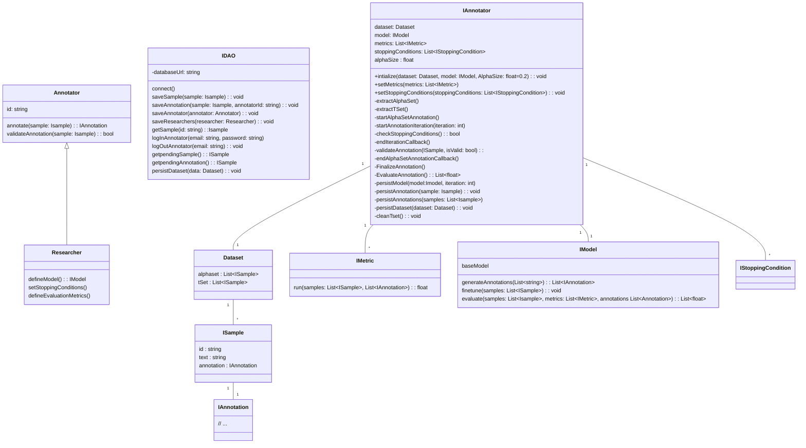

```mermaid
classDiagram

    class Annotator {
        id: string
        annotate(sample: Isample): IAnnotation
        validateAnnotation(sample: Isample): bool
    }

    class IDAO {
        -databaseUrl: string
        connect()
        saveSample(sample: Isample): void
        saveAnnotation(sample: Isample, annotatorId: string): void
        saveAnnotator(annotator: Annotator): void
        saveResearchers(researcher: Researcher): void
        getSample(id: string):Isample
        logInAnnotator(email: string, password: string)
        logOutAnnotator(email: string): void
        getpendingSample(): ISample
        getpendingAnnotation(): ISample
        persistDataset(data: Dataset): void
    }

    class Researcher{
        defineModel(): IModel
        setStoppingConditions()
        defineEvaluationMetrics()
    }

    class Dataset {
        alphaset : List~ISample~
        tSet : List~ISample~
    }

    class ISample {
        id : string
        text : string
        annotation : IAnnotation
    }

    class IMetric {
        run(samples: List~ISample~, List~IAnnotation~): float
    }


    class IModel {
        baseModel
        generateAnnotations(List~string~): List~IAnnotation~
        finetune(samples: List~ISample~): void
        evaluate(samples: List~Isample~, metrics: List~IMetric~, annotations List~Annotation~): List~float~ 
    }


    class IAnnotation {
        // ...
    }

    class IAnnotator{
        dataset: Dataset
        model: IModel
        metrics: List~IMetric~
        stoppingConditions: List~IStoppingCondition~
        alphaSize : float

        +intialize(dataset: Dataset, model: IModel, AlphaSize: float=0.2 ): void
        +setMetrics(metrics: List~IMetric~)
        +setStoppingConditions(stoppingConditions: List~IStoppingCondition~): void
        -extractAlphaSet()
        -extractTSet()
        -startAlphaSetAnnotation()
        -startAnnotationIteration(iteration: int)
        -checkStoppingConditions(): bool
        -endIterationCallback()
        -validateAnnotation(ISample, isValid: bool): 
        -endAlphaSetAnnotationCallback()
        -FinalizeAnnotation()
        -EvaluateAnnotation(): List~float~
        -persistModel(model:Imodel, iteration: int)
        -persistAnnotation(sample: Isample): void
        -persistAnnotations(samples: List~Isample~)
        -persistDataset(dataset: Dataset): void
        -cleanTset(): void
    }

    IAnnotator "1" -- "1" IModel
    IAnnotator "1" -- "1" Dataset
    IAnnotator "1" -- "*" IMetric
    IAnnotator "1" -- "*" IStoppingCondition
    Dataset "1" -- "*" ISample
    ISample "1" -- "1" IAnnotation
    Annotator <| -- Researcher

```