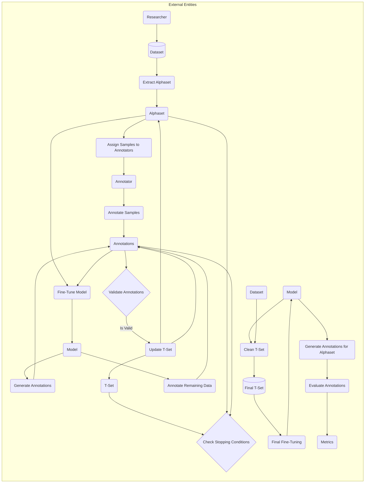

```mermaid
flowchart LR
    subgraph External Entities
        A(Researcher)
        B(Annotator)
        C[(Dataset)]
        D(Extract Alphaset)
        E(Assign Samples to Annotators)
        F(Annotate Samples)
        G(Fine-Tune Model)
        H(Generate Annotations)
        I{Validate Annotations}
        J(Update T-Set)
        K{Check Stopping Conditions}
        L(Annotate Remaining Data)
        M(Clean T-Set)
        N(Final Fine-Tuning)
        O(Generate Annotations for Alphaset)
        P(Evaluate Annotations)
        R(Dataset)
        S(Alphaset)
        T(T-Set)
        T2[(Final T-Set)]
        U(Model)
        U2(Model)
        V(Annotations)
        W(Metrics)
    end

    A --> C --> D --> S --> E --> B --> F --> V
    S & V --> G --> U  --> H --> V --> I -->|Is Valid | J --> T & S & V --> K
    U --> L --> V
    U2 & R --> M --> T2 --> N --> U2 --> O --> P --> W
```